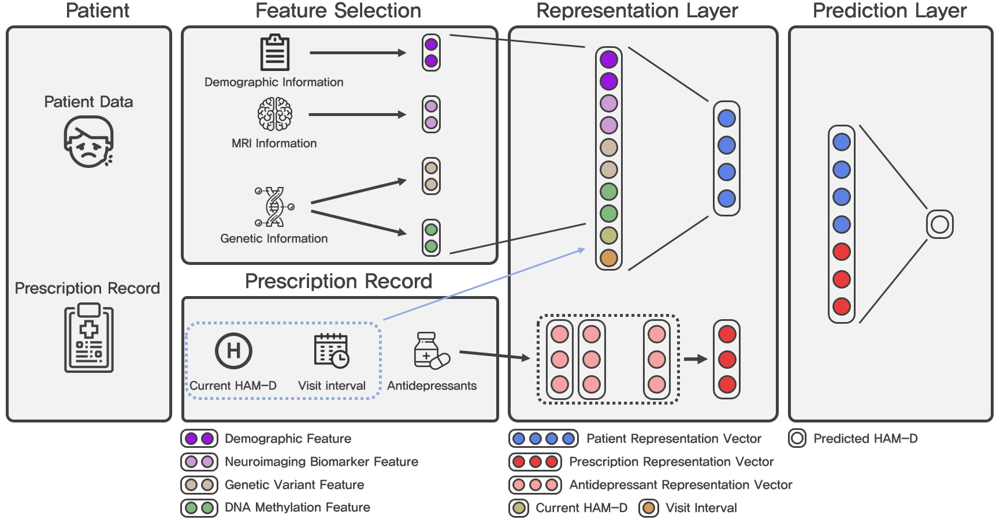

# ARPNet

This repository provides implementation code of ARPNet, a Antidepressant Response Prediction Network for Major Depressive Disorder.

## Installation
The experiments were conducted on a single TITAN Xp GPU machine which has 12GB of RAM.
The implemntation code of ARPNet was tested with the following requirements:
*   **[`Python2.7.12`](https://www.python.org/downloads/release/python-2712/)**
*   **[`TensorFlow1.6.0`](https://www.tensorflow.org/install/)**

## Datasets
### Description
We conducted experients on the data of 121 patients with MDD collected from Korea University Anam Hospital, Seoul, Korea. By several feature selection steps, we extracted some useful features, which are demographic, neuroimaging biomarkers, genetic variants, and DNA methylation features, for predicting antidepressant response from patient data. Because of the Korea University Anam Hospital's policies related to the patients' personal information, the data used in the experiment could not be released. 

### Toy Smaples
To run our implementation code, we release the toy samples `\toy\train_1.tsv`, `\toy\train_2.tsv`, `\toy\test_1.tsv`, `\toy\test_2.tsv` , and `\toy\patient_data.tsv`
* `train_1.tsv` and `test_1.tsv` are used for the prediction of the degree of antdepressant response (Task 1). 
* `train_2.tsv` and `test_2.tsv` are used for the prediction of the clinical remession of patients (Task 2).
* `patient_data.tsv` consists of demographic, neuroimaging biomarkers, genetic variants, and DNA methylation features.

## Run
Following command runs ARPNet code on toy samples with default parameters.
```
python run.py \
    --task=1
```
You can change the task as you want. Once you perfrom task 2, you can use it in task mode by using `--task=2`

## Citation

If we submit the paper to a conference or journal, we will update the BibTeX.

## Contact information

For help or issues using ARPNet, please submit a GitHub issue. Please contact Buru Chang
(`buru_chag (at) korea.ac.kr`), or Yonghwa Choi (`yonghwachoi (at) korea.ac.kr`) for communication related to ARPNet.
